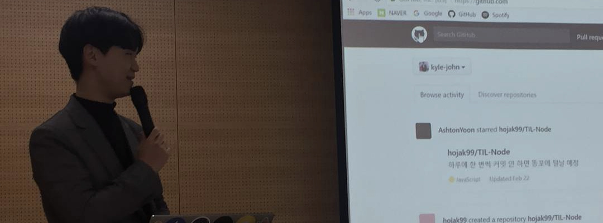

### Hi there 👋

<!--
**kyle-seongwoo-jun/kyle-seongwoo-jun** is a ✨ _special_ ✨ repository because its `README.md` (this file) appears on your GitHub profile.

Here are some ideas to get you started:

- 👯 I’m looking to collaborate on ...
- 🤔 I’m looking for help with ...
- 💬 Ask me about ...
- 😄 Pronouns: ...
- ⚡ Fun fact: ...

-->

- 🔭 I’m currently working at [Aurender Inc](https://aurender.com/).
- 👨‍💻 Skills: 
  - ❤️ Loves: [.NET](https://dotnet.microsoft.com/), [C#](https://docs.microsoft.com/en-us/dotnet/csharp/), [Xamarin](https://dotnet.microsoft.com/apps/xamarin)
  - 😃 Enjoys: [TypeScript](https://www.typescriptlang.org/), [node.js](https://nodejs.org/)
  - 🌱 Learning: [Flutter](https://flutter.dev/), [dart](https://dart.dev/)
- 📫 How to reach me: 
  - 📧 Email: njk230@gmail.com
  - ✍️ Medium: [@kyle_seongwoo_jun](https://medium.com/@kyle_seongwoo_jun/)
  - 📸 Instagram: [@seongxwoo](https://www.instagram.com/seongxwoo/)
